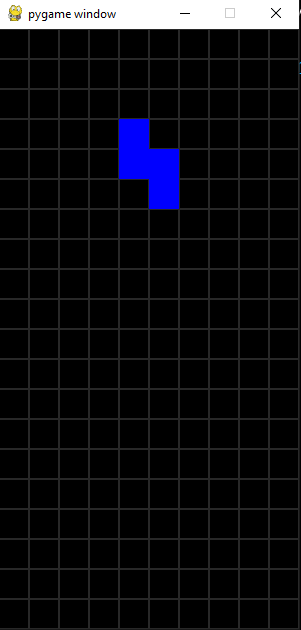

## About

This is classic tetris game with GUI.

## Setup
1. Clone this repo with `git clone`
2. Install **pygame** and **numpy**
    * `pip install pygame`
    * `pip install numpy`
3. Now you should be able to run *main.py*